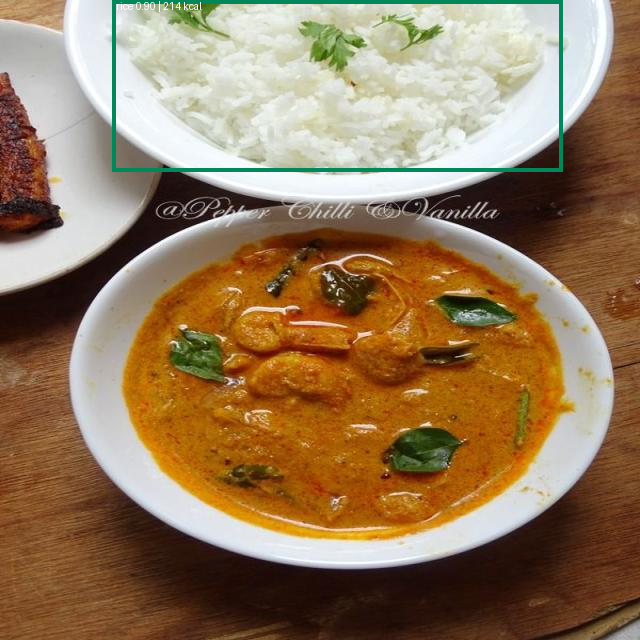
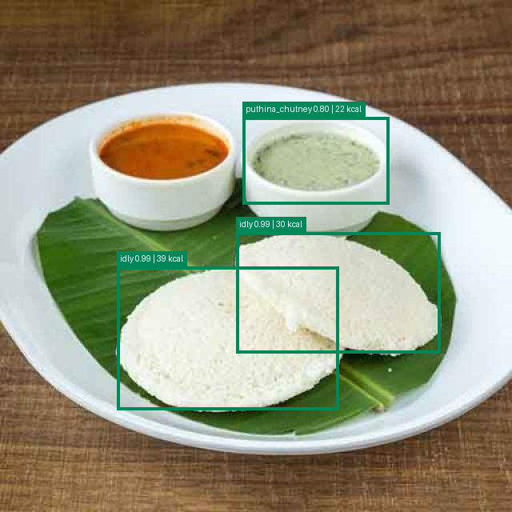
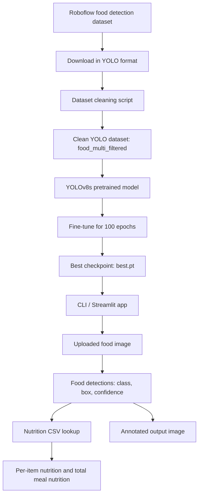
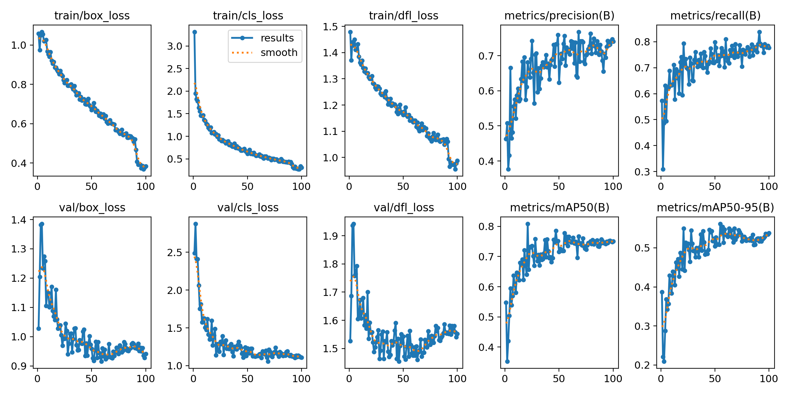
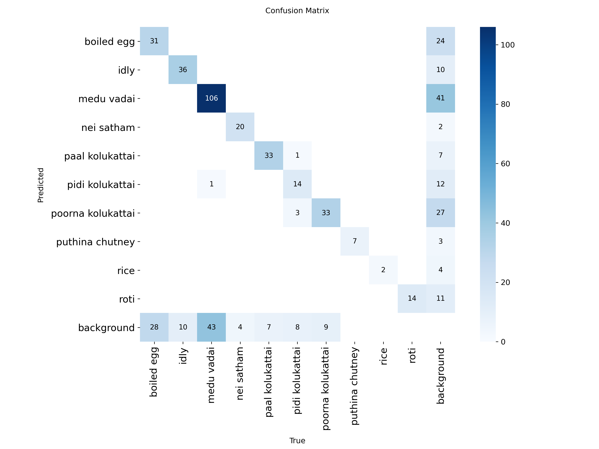

# Food Image Analysis

This is my Python submission for the food image analysis assignment. The app takes an image, detects food items with a fine-tuned YOLO model, and gives approximate nutrition for each detected item and for the full meal.

## Sample Outputs

Food detection with nutrition table:



Another tested output:



Empty plate / no food handling:


More tested screenshots:

<details>
<summary>Click to view output screenshots</summary>

<br>


</details>

## What It Does

- accepts `.jpg`, `.jpeg`, and `.png`
- detects multiple trained food items in one image
- shows food name, confidence, calories, protein, carbs, and fat
- calculates total nutrition
- returns `No food items detected.` when nothing is detected
- supports both CLI and Streamlit upload UI

## Architecture

The project has two main flows: training/fine-tuning and inference.



Inference flow:

```text
input image
  -> YOLOv8s fine-tuned detector
  -> food class + bounding box + confidence
  -> nutrition.csv lookup
  -> item-wise nutrition table
  -> total nutrition
  -> annotated image output
```

## Model

I used YOLO because this is an object detection task. A classifier like Food-101 gives one main label for an image, but this assignment asks to detect all food items present in the image.

Final model used for submission:

```text
runs/detect/runs/food-analysis/yolov8-food-2/weights/best.pt
```

The pretrained YOLO base checkpoint used for fine-tuning is also included:

```text
models/yolov8s.pt
```

I chose this 10-class model over the broader 31-class model because HR specifically asked for accurate results. The 10-class model has fewer classes, but it performs better and gives cleaner predictions.

Validation result:

```text
Precision: 0.740
Recall:    0.777
mAP50:     0.751
mAP50-95:  0.538
```

## Evaluation Metrics

| metric | value | meaning |
| --- | ---: | --- |
| Precision | 0.740 | How many predicted food boxes were correct |
| Recall | 0.777 | How many actual food objects were detected |
| mAP50 | 0.751 | Main detection score at IoU 0.50 |
| mAP50-95 | 0.538 | Stricter detection score across IoU 0.50 to 0.95 |

Training result plots:



Confusion matrix:



Training artifacts are included under:

```text
runs/detect/runs/food-analysis/yolov8-food-2/
```

This folder contains `best.pt`, `results.csv`, `results.png`, confusion matrix images, PR/F1 curves, label distribution, and validation prediction images.

Training command:

```bash
python scripts/train.py \
  --data data/food_detection.yaml \
  --base-model models/yolov8s.pt \
  --epochs 100 \
  --imgsz 640 \
  --batch 16 \
  --device 0 \
  --name yolov8-food-2
```

Fine-tuning steps:

```text
1. Download Roboflow dataset in YOLO format.
2. Filter dataset to 10 stronger food classes.
3. Convert polygon labels to bounding boxes where required.
4. Remove invalid/tiny boxes.
5. Create clean YOLO data config.
6. Load pretrained YOLOv8s checkpoint.
7. Train for 100 epochs on GPU.
8. Select best.pt from validation performance.
```

## Dataset

Source dataset:

```text
Roboflow foodmodel/food-detection-bbpkw v2
https://universe.roboflow.com/foodmodel/food-detection-bbpkw/dataset/2
```

The raw dataset had many weak classes and some polygon labels. I converted polygon labels to bounding boxes and kept the stronger classes for better accuracy.

Dataset preparation:

```bash
python scripts/prepare_filtered_dataset.py --source dataset --output datasets/food_multi_filtered
```

Final training dataset:

```text
datasets/food_multi_filtered
```

The full training image folders are not included in this zip because the dataset is publicly available from Roboflow and can be recreated using the cleaning script above. The dataset config, cleaning script, class list, counts, and source link are included.

Cleaning steps I used:

- selected only the stronger 10 food classes
- converted polygon/segmentation labels to YOLO bounding boxes
- removed classes not used for final training
- removed invalid boxes and very tiny boxes
- kept empty-label training images as negative/background examples
- recreated a clean YOLO `data.yaml`

Dataset summary:

```text
Train images: 1249
Validation images: 204
Test images: 94
Total classes: 10
Food objects: 2910
Multi-object images: 373
Negative/empty-label training images: 136
Label errors after conversion: 0
```

Classes used:

| class | train | valid | test | total |
| --- | ---: | ---: | ---: | ---: |
| boiled egg | 262 | 59 | 25 | 346 |
| idly | 250 | 46 | 11 | 307 |
| medu vadai | 444 | 150 | 78 | 672 |
| nei satham | 86 | 24 | 12 | 122 |
| paal kolukattai | 158 | 40 | 20 | 218 |
| pidi kolukattai | 196 | 26 | 10 | 232 |
| poorna kolukattai | 255 | 42 | 23 | 320 |
| puthina chutney | 122 | 7 | 2 | 131 |
| rice | 193 | 2 | 0 | 195 |
| roti | 352 | 14 | 1 | 367 |

## Setup

```bash
python -m venv .venv
source .venv/bin/activate
pip install -r requirements.txt
pip install -e .
```

## Run Inference

```bash
food-analyze \
  --image "path/to/image.jpg" \
  --model runs/detect/runs/food-analysis/yolov8-food-2/weights/best.pt \
  --save-annotated outputs/output.png
```

JSON output:

```bash
food-analyze \
  --image "path/to/image.jpg" \
  --model runs/detect/runs/food-analysis/yolov8-food-2/weights/best.pt \
  --json
```

Tested output images and screenshots are kept in:

```text
outputs/
```

## Project Structure

```text
app.py
README.md
requirements.txt
pyproject.toml
data/
  food_detection.yaml
  nutrition.csv
datasets/
  food_multi_filtered/
    data.yaml
    train/images/
    train/labels/
    valid/images/
    valid/labels/
    test/images/
    test/labels/
models/
  yolov8s.pt
outputs/
  real_multi_food_sample_annotated.png
  all_classes_test_annotated.png
  sample_output.json
runs/detect/runs/food-analysis/yolov8-food-2/
  weights/best.pt
  results.csv
  results.png
  confusion_matrix.png
  confusion_matrix_normalized.png
  BoxF1_curve.png
  BoxPR_curve.png
  BoxP_curve.png
  BoxR_curve.png
samples/
scripts/
  prepare_filtered_dataset.py
  train.py
src/food_analysis/
  analyzer.py
  cli.py
  nutrition.py
  schemas.py
  visualization.py
```

## Streamlit App

```bash
streamlit run app.py
```

The app uses the same model and shows the annotated image, detected items, and total nutrition. The sidebar shows the trained classes so the user knows the model scope.

## Nutrition

Nutrition values are stored in:

```text
data/nutrition.csv
```

The values are approximate. A normal RGB image cannot give exact calories because exact nutrition depends on food weight, recipe, oil, and cooking method.

## Limitations

- The model detects only the 10 classes listed above.
- Pizza, burger, fruits, tea, sambar, mutton, and fish are not covered by this submitted checkpoint.
- For broader food coverage, I would collect balanced YOLO datasets for fruits, vegetables, pizza, burger, chicken, fish, mutton, tea, and more Indian/Telugu dishes, then train a separate broader model.
